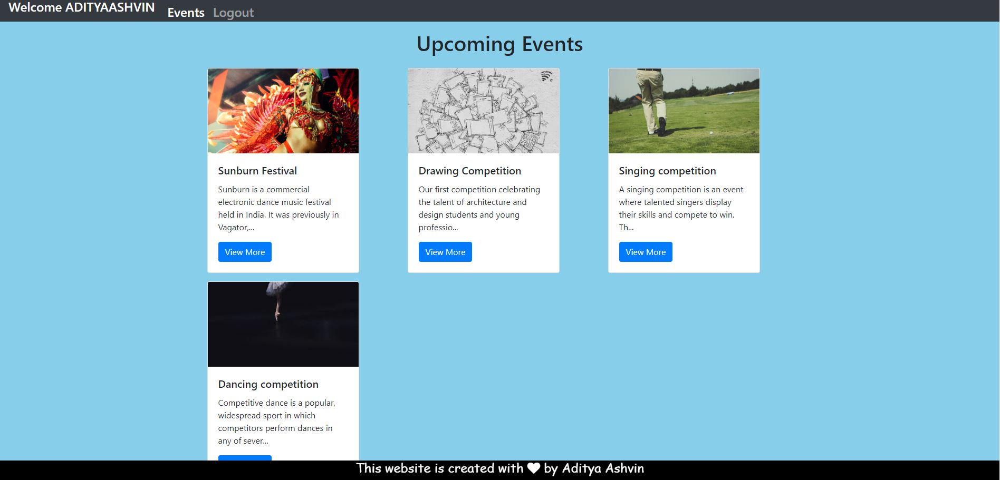

# Event Registration Website 2.0

# Overview of the Project
> The project consists of the following pages
>- A Landing page.
>- Admin Login page and Registration page.
>- Participant Registration and Login page.
>- Participant dashboard.
>- Admin dashboard.
# Getting Started
These instructions will get you a copy of the project up and running on your local machine for development and testing purposes.
> ## Prerequisites
> First you need to install xampp.
>- download xampp here [Xampp download for windows, mac os and ubuntu](https://www.apachefriends.org/download.html)
> Steps to install and setup xampp:-
>- [For Windows](https://pureinfotech.com/install-xampp-windows-10/)
>- [For Mac OS](https://www.webucator.com/how-to/how-install-start-test-xampp-on-mac-osx.cfm)
>- [For Ubuntu](https://vitux.com/how-to-install-xampp-on-your-ubuntu-18-04-lts-system/)
> If you don't want to use xampp you can also use, 
>- [WAMP](https://www.instructables.com/id/Installing-WAMP-Server/) 
>- [LAMP](https://medium.com/better-programming/how-to-install-lamp-stack-on-ubuntu-db77ac018116) For Ubuntu
>- [LEMP](https://www.google.com/amp/s/websiteforstudents.com/how-to-install-lemp-on-ubuntu-16-04-18-04-18-10/amp/) 
>- [MAMP](https://documentation.mamp.info/en/MAMP-Mac/Installation/) For Mac OS
>- AMPPS
>- WPN-XM
>- EasyPHP
>- Final Words

> ## Running the project in your local machine
>- Clone the project to your local machine using the given code in the Git terminal.
> **git clone https://github.com/AdityaAshvin/Event_Registration_website.git
>- Then Copy this file to the ***httdocs*** folder in the ***xampp*** folder.
>- Check whether MySQL and Apache are up and running by starting them using the xampp control panel.
>- Then open ur browser and type **http://localhost/Event_Registration_website/LandingPage.html**
> ## Working with phpMyadmin
>- Open your browser and paste this url *http://localhost/phpmyadmin/*
>- Create a database with name as **event_registration**. Then create a table named as **admin** in the database. create four colums one each for ***id, username, email and password***.
>- In the same database create a table with name as **participant**. Create four colums one each for ***id, username, email and password***.
>- In the same database also create a table with name as **events**. Create four colums one each for ***id, title, header and body***.
>- Once you have done the above mentioned steps the project will be up and running in your local machine.

### LandingPage:-

### Admin dashboard HomePage:-

### Admin dashboard UsersPage:-

### Admin login page:-

### Participant login and registration page:-

### Participant dashboard:-

### Older repository: https://github.com/AdityaAshvin/amFOSS-project
